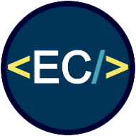

# Eric Crain

Deployed Application: 

GitHub Repository: https://github.com/Ericcrain77/Portfolio-V2

## Licensing

## Table of Contents
* [Description](#description)
* [Wireframing](#wireframing)
* [Technologies](#technologies)
* [Questions](#questions)

## Description
This is a repository of my professional portfolio. 

## Technologies
This app was built using the ReactJS framework.

## Questions
Reach out to me using my [Github account](https://github.com/Ericcrain77) or my [email](ericcrain77@gmail.com).